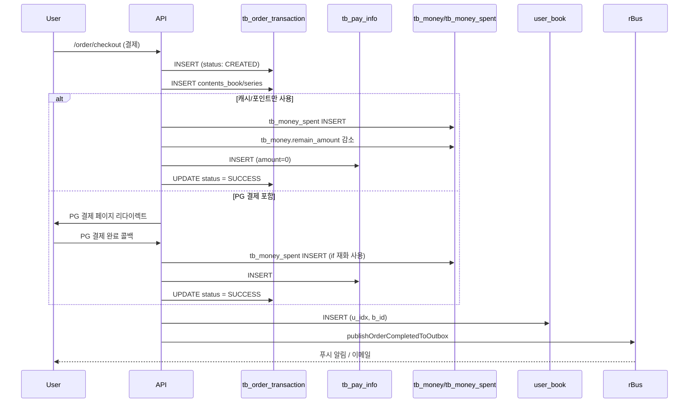
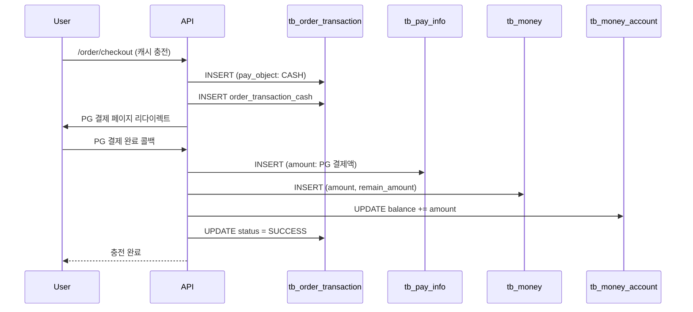
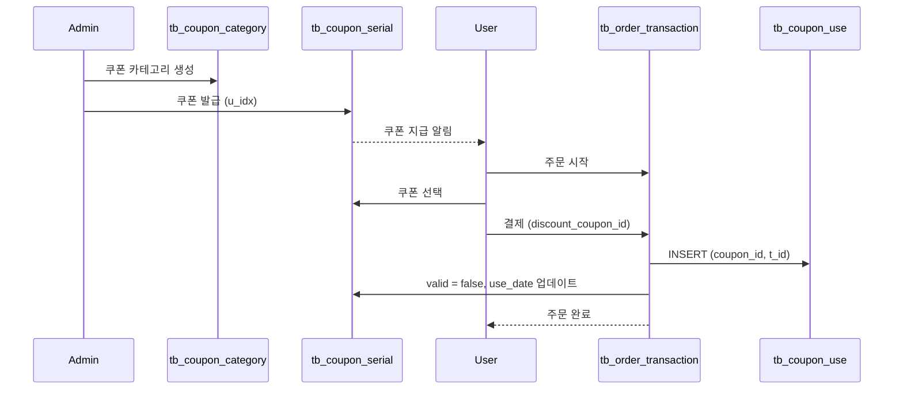
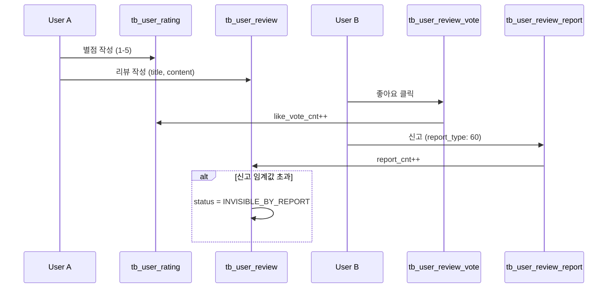

# RIDI 데이터베이스 스키마 종합 문서

> 작성일: 2026-02-04
> 
> 이 문서는 RIDI 프로젝트의 주요 데이터베이스 테이블과 그 관계를 상세히 설명합니다.

## 목차

1. [개요](#개요)
2. [도메인별 다이어그램](#도메인별-다이어그램)
3. [테이블 상세 정보](#테이블-상세-정보)
   - [3.1 주문 & 결제 도메인](#31-주문--결제-도메인)
   - [3.2 재화 관리 도메인](#32-재화-관리-도메인)
   - [3.3 도서 & 상품 도메인](#33-도서--상품-도메인)
   - [3.4 프로모션 & 쿠폰 도메인](#34-프로모션--쿠폰-도메인)
   - [3.5 리뷰 & 피드백 도메인](#35-리뷰--피드백-도메인)
4. [주요 관계 설명](#4-주요-관계-설명)
5. [주요 비즈니스 플로우](#5-주요-비즈니스-플로우)
6. [참고 정보](#6-참고-정보)

---

## 1. 개요

### 데이터베이스 구조

RIDI 데이터베이스는 전자책 유통 플랫폼의 다양한 기능을 지원하기 위해 설계되었습니다. 주요 도메인은 다음과 같이 분류됩니다:

- **주문 & 결제 도메인**: 도서 구매, 캐시 충전, 구독 등 모든 거래 처리
- **재화 관리 도메인**: 캐시와 포인트 충전, 사용, 소진 관리
- **도서 & 상품 도메인**: 도서 메타데이터, 시리즈, 카테고리, 가격 정보
- **프로모션 & 쿠폰 도메인**: 쿠폰, 이벤트, 캠페인, 기다무 등 프로모션 관리
- **리뷰 & 피드백 도메인**: 사용자 리뷰, 평점, 신고, 차단 등

### 스키마 파일 위치

데이터베이스 스키마 정의 파일은 [`backends/src/db/schemas/`](./src/db/schemas/) 디렉토리에 위치합니다:

- `bom.sql` - 주문, 결제, 도서, 프로모션 등 핵심 테이블
- `ownership.sql` - 사용자 도서 소유권 관리
- `platform_finance.sql` - 재화 관련 테이블
- `ridiselect.sql` - 리디셀렉트 구독 관련
- 기타 도메인별 스키마 파일들

---

## 2. 도메인별 다이어그램

모든 도메인 다이어그램은 Excalidraw로 생성되었으며, 다음 캔버스에서 확인할 수 있습니다:

🔗 **Excalidraw 다이어그램**: http://localhost:3000 (로컬 Excalidraw 서버)

### 다이어그램 범례

- **파란색 박스**: 주문 & 결제 관련 테이블
- **녹색 박스**: 결제 정보 관련 테이블
- **노란색 박스**: 정기 결제 관련 테이블
- **보라색 박스**: 재화(캐시/포인트) 관련 테이블
- **분홍색 박스**: 도서 & 상품 관련 테이블
- **하늘색 박스**: 사용자 소유권 관련 테이블
- **주황색 박스**: 쿠폰 관련 테이블
- **남색 박스**: 캠페인 관련 테이블
- **연두색 박스**: 기다무 관련 테이블
- **자주색 박스**: 이벤트 관련 테이블
- **노란색 박스**: 리뷰 & 피드백 관련 테이블

---

## 3. 테이블 상세 정보

### 3.1 주문 & 결제 도메인

주문 및 결제 처리의 핵심이 되는 테이블들입니다. 사용자가 도서를 구매하거나 캐시를 충전할 때 이 테이블들에 데이터가 저장됩니다.

#### tb_order_transaction

**목적**: 주문 트랜잭션의 기본 정보를 저장하는 핵심 테이블

**주요 컬럼**:
- `id` (bigint unsigned, PK): 주문 ID
- `transaction_id` (varchar(64), UNIQUE): 주문번호 (예: 2025XXXX)
- `user_idx` (bigint unsigned): 사용자 ID
- `status` (enum): 주문 상태
  - `CREATED`: 생성됨
  - `IN_PROGRESS`: 처리 중
  - `SUCCESS`: 성공
  - `FAILURE`: 실패
- `pay_object` (int): 결제 대상 (도서, 캐시, 구독 등)
- `pay_type` (int): 결제 유형 (캐시, 포인트, PG 등)
- `order_amount` (int): 총 주문 금액
- `pg_amount` (int): PG 결제 금액
- `cash_amount_to_spend` (int): 사용할 캐시 금액
- `point_amount_to_spend` (int): 사용할 포인트 금액
- `discount_coupon_id` (bigint unsigned): 할인 쿠폰 ID
- `tax_deductible` (tinyint): 소득공제 가능 여부
- `return_url` (varchar(2048)): 결제 완료 후 리다이렉트 URL
- `return_url_on_failure` (varchar(2048)): 결제 실패 시 리다이렉트 URL
- `user_agent` (varchar(255)): 사용자 에이전트
- `google_analytics_firebase_app_id` (varchar(255)): GA/Firebase 앱 ID
- `google_analytics_client_id` (varchar(255)): GA 클라이언트 ID
- `google_analytics_session_id` (varchar(255)): GA 세션 ID
- `attribution_tool_params` (text): 어트리뷰션 도구 파라미터
- `created_at` (datetime): 생성 시각
- `updated_at` (datetime): 수정 시각

**관계**:
- → `tb_order_transaction_cash` (1:1, order_id로 연결)
- → `tb_order_transaction_contents_book` (1:N, order_id로 연결)
- → `tb_order_transaction_contents_series` (1:N, order_id로 연결)
- → `tb_order_transaction_gift` (1:1, order_id로 연결)
- → `tb_order_transaction_subscription` (1:1, order_id로 연결)
- → `tb_pay_info` (1:1, transaction_id = t_id로 연결)

**비즈니스 규칙**:
- `/order/checkout` API에서 결제하기 버튼을 누르면 데이터가 생성됨
- `transaction_id`는 외부 노출용 주문번호로 사용됨

#### tb_order_transaction_cash

**목적**: 캐시 충전 주문의 상세 정보

**주요 컬럼**:
- `id` (bigint unsigned, PK): ID
- `order_id` (bigint unsigned, UNIQUE, FK → tb_order_transaction.id): 주문 ID
- `cash_amount` (int): 충전 캐시 금액

**관계**:
- ← `tb_order_transaction` (1:1)

#### tb_order_transaction_contents_book

**목적**: 주문에 포함된 도서 정보 (단권, 세트)

**주요 컬럼**:
- `id` (int, PK): ID
- `order_id` (bigint unsigned, FK → tb_order_transaction.id): 주문 ID
- `book_id` (varchar(32)): 도서 ID
- `regular_price` (int): 소장 정가
- `selling_price` (int): 소장 판매가
- `rental_price` (int): 대여 판매가
- `rental_period` (int): 대여 기간 (일)

**관계**:
- ← `tb_order_transaction` (N:1)

**비즈니스 규칙**:
- 유저가 바로 구매할 수 있는 단위로 도서 정보가 저장됨 (단권, 세트)
- 주문 당시의 판매가와 정가 정보가 기록되어 히스토리로 남음

#### tb_order_transaction_contents_series

**목적**: 주문에 포함된 시리즈 전권 소장/대여 정보

**주요 컬럼**:
- `id` (int, PK): ID
- `order_id` (bigint unsigned, FK → tb_order_transaction.id): 주문 ID
- `series_id` (varchar(32)): 시리즈 ID
- `regular_price` (int): 정가
- `selling_price` (int): 판매가
- `type` (varchar): 타입 (소장/대여)

**관계**:
- ← `tb_order_transaction` (N:1)

#### tb_order_transaction_gift

**목적**: 선물 주문의 상세 정보

**주요 컬럼**:
- `id` (int, PK): ID
- `order_id` (bigint unsigned, UNIQUE, FK → tb_order_transaction.id): 주문 ID
- `send_method_type` (enum): 전송 방법 (email/sms/ridi)
- `send_method_value` (varchar(255)): 전송 대상 (이메일 주소, 전화번호 등)
- `sender_name` (varchar(255)): 발신자 이름
- `text` (text): 선물 메시지

**관계**:
- ← `tb_order_transaction` (1:1)

#### tb_order_transaction_subscription

**목적**: 구독 주문의 상세 정보

**주요 컬럼**:
- `id` (bigint unsigned, PK): ID
- `order_id` (bigint unsigned, UNIQUE, FK → tb_order_transaction.id): 주문 ID
- `billing_id` (bigint unsigned, FK → tb_billing.id): 정기 결제 ID
- `type` (enum): 구독 타입
  - `PERIODIC`: 매월 1일 자동충전
  - `BALANCE-BASED`: 잔액 기준 자동충전
  - `KANTA`: 칸타 구독
  - `RIDISELECT`: 리디셀렉트

**관계**:
- ← `tb_order_transaction` (1:1)
- → `tb_billing` (N:1)

#### tb_pay_info

**목적**: 완료된 결제 정보를 저장하는 테이블. 주문뿐만 아니라 포인트/캐시 지급 내역도 저장됨

**주요 컬럼**:
- `id` (bigint unsigned, PK): 결제 ID
- `t_id` (varchar(64), UNIQUE): 주문번호
- `u_idx` (bigint unsigned): 사용자 ID
- `cancel` (char(1)): 취소 여부 (Y/N)
- `amount` (int): PG 결제 금액 (현금이 들어온 금액)
- `sum` (int): 총 주문 금액
- `note` (varchar(255)): 설명
- `pay_type` (int): 결제 형태
- `pay_object` (int): 결제 대상
- `service_id` (varchar(3)): 서비스 ID
- `reg_date` (varchar(14)): 등록 일자
- `cancel_date` (varchar(14)): 취소 일자
- `pg_tid` (varchar(64)): PG사 주문번호
- `payer_name` (varchar(32)): 외부 결제자명
- `device` (varchar(32)): 디바이스
- `platform` (varchar(255)): 플랫폼 (web/ios/android/onestore)
- `is_hidden` (tinyint(1)): 숨김 여부
- `manually_confirmed_at` (datetime): 수동 구매 확정 시각
- `last_modified` (datetime): 마지막 수정 일자

**관계**:
- ← `tb_order_transaction` (1:1, t_id = transaction_id로 연결)
- → `tb_pay_info_cancel` (1:N)
- → `tb_pay_info_event` (1:N)
- → `tb_pay_info_price_gap` (1:1, t_id로 연결)
- → `tb_money` (1:N, pay_id로 역참조)
- → `tb_money_spent` (1:N, pay_id로 역참조)

**비즈니스 규칙**:
- `tb_pay_info.sum + tb_pay_info_price_gap.gap = 주문 금액`
- 주문과 관련 없는 내역(포인트 지급, 캐시 지급 등)도 이 테이블에 저장됨

#### tb_pay_info_cancel

**목적**: 결제 취소 정보

**주요 컬럼**:
- `id` (bigint unsigned, PK): 취소 ID
- `uuid` (binary(16), UNIQUE): 외부 노출용 취소 주문 ID
- `pay_id` (bigint unsigned, FK → tb_pay_info.id): 결제 ID
- `pg_tid` (varchar(64)): PG사 취소 주문 번호
- `sum` (int): 취소 금액
- `amount` (int): PG 취소 금액
- `cancel_date` (datetime): 취소 완료 시간
- `created_at` (datetime): 생성 시각

**관계**:
- ← `tb_pay_info` (N:1)
- → `tb_money_spent_cancel` (1:N)

#### tb_pay_info_event

**목적**: 결제 이벤트 로그 (사용자 에이전트, IP 주소 등)

**주요 컬럼**:
- `id` (bigint unsigned, PK): ID
- `payment_id` (bigint unsigned, FK → tb_pay_info.id): 결제 ID
- `pay_cancel_id` (bigint unsigned): 취소 ID
- `type` (varchar): 이벤트 타입
- `ip_address` (varchar(45)): IP 주소
- `user_agent` (text): 사용자 에이전트

**관계**:
- ← `tb_pay_info` (N:1)

**비즈니스 규칙**:
- 유저가 결제를 하면 user agent와 IP 정보를 기록함

#### tb_pay_info_price_gap

**목적**: 쿠폰 할인 등으로 인한 가격 차이 기록

**주요 컬럼**:
- `id` (bigint unsigned, PK): ID
- `t_id` (varchar(64), FK → tb_pay_info.t_id): 주문번호
- `gap` (int): 가격 차이 (할인 금액)
- `reason` (varchar(255)): 사유

**관계**:
- ← `tb_pay_info` (1:1)

**비즈니스 규칙**:
- 쿠폰 할인이 있는 경우 할인 금액 정보가 기록됨
- `tb_pay_info.sum + gap = 실제 주문 금액`

#### tb_billing

**목적**: 정기 결제 수단 정보 (구독, 자동충전 등)

**주요 컬럼**:
- `id` (bigint unsigned, PK): 정기 결제 ID
- `u_idx` (bigint unsigned): 사용자 ID
- `product_name` (varchar(255)): 상품명
- `pg_type` (enum): PG 종류
  - `RIDIPAY`: 리디페이
  - `XPAY`: LG U+ XPay
  - `PAYLETTER`: 페이레터
  - `PPAY`: PPay
  - `TOSSPAYMENTS`: 토스페이먼츠
- `bill_key` (varchar(200)): PG사 빌키
- `card_brand` (varchar(255)): 카드 브랜드
- `masked_card_no` (varchar(255)): 마스킹된 카드 번호
- `partner_bill_key` (varchar(255)): 제휴 구독 빌키
- `created_at` (datetime): 생성 시각

**관계**:
- → `tb_billing_result` (1:N)
- → `tb_billing_easy_pay` (1:1)
- → `tb_order_transaction_subscription` (1:N, billing_id로 역참조)
- → `tb_pay_info_periodic_cash_charge_plan` (1:N, billing_id로 역참조)
- → `tb_balanced_based_cash_charge_plan` (1:N, billing_id로 역참조)
- → `tb_user_ridi_select_subscription` (1:N, billing_id로 역참조)

**비즈니스 규칙**:
- 잔액 기준 자동충전, 매월 1일 자동충전, 리디셀렉트에서 사용
- PG사 bill key와 미인증 결제 수단 정보를 저장

#### tb_billing_result

**목적**: 정기 결제 실행 결과 및 히스토리

**주요 컬럼**:
- `id` (bigint unsigned, PK): ID
- `billing_id` (bigint unsigned, FK → tb_billing.id): 정기 결제 ID
- `t_id` (varchar(64)): 주문번호
- `currency` (enum): 통화 (KRW/USD)
- `amount` (int unsigned): 금액
- `is_success` (tinyint unsigned): 성공 여부
- `pg_tid` (varchar(64)): PG사 결제 ID
- `pg_response_code` (char(4)): PG 응답 코드
- `pg_response_message` (varchar(255)): PG 응답 메시지
- `pg_response_json` (longtext): PG 응답 전체 (JSON)
- `created_at` (datetime): 생성 시각
- `canceled_at` (datetime): 취소 시각

**관계**:
- ← `tb_billing` (N:1)

#### tb_billing_easy_pay

**목적**: 간편 결제 정기 결제 정보

**주요 컬럼**:
- `id` (bigint unsigned, PK): ID
- `billing_id` (bigint unsigned, FK → tb_billing.id): 정기 결제 ID
- `u_idx` (bigint unsigned): 사용자 ID
- `state` (enum): 상태 (normal/deleted/abnormal)
- `created_at` (datetime): 생성 시각
- `last_modified_at` (datetime): 최근 수정 시각

**관계**:
- ← `tb_billing` (1:1)

---

### 3.2 재화 관리 도메인

캐시와 포인트의 충전, 사용, 소진을 관리하는 테이블들입니다.

#### tb_money_account

**목적**: 사용자별 재화 잔액을 관리하는 요약 테이블 (성능 최적화)

**주요 컬럼**:
- `id` (bigint unsigned, PK): ID
- `u_idx` (bigint unsigned): 사용자 ID
- `money_type` (smallint unsigned): 재화 타입
  - `1`: CASH (캐시)
  - `2`: POINT (포인트)
- `balance` (int unsigned): 현재 잔액
- `updated_at` (datetime): 최종 잔액 변경 일시
- `earliest_expire_at` (datetime): 가장 먼저 만료될 재화의 만료 일시

**Unique 제약**: (`u_idx`, `money_type`)

**관계**:
- → `tb_money` (1:N, u_idx와 money_type로 연결)

**비즈니스 규칙**:
- 유저 재화를 한 번에 summary한 테이블
- 잔액 조회 성능 개선을 위해 row 1개로 잔액을 조회할 수 있음
- u_idx별로 cash는 얼마, point는 얼마 이런 식으로 summary되어 있음

#### tb_money

**목적**: 개별 재화 충전 내역 (FIFO 방식으로 관리)

**주요 컬럼**:
- `id` (bigint unsigned, PK): 재화 ID
- `u_idx` (bigint unsigned): 사용자 ID
- `money_type` (smallint unsigned): 재화 타입 (1:CASH, 2:POINT)
- `amount` (int): 충전 금액
- `remain_amount` (int): 사용 후 남은 잔액
- `pay_id` (bigint, FK → tb_pay_info.id): 결제 ID
- `pay_type` (int): 결제 유형
- `comments` (varchar(255)): 설명
- `canceled_at` (datetime): 취소 일시
- `created_at` (datetime): 생성 일시
- `updated_at` (datetime): 수정 일시
- `expire_at` (datetime): 만료 일시

**외래키**: (`u_idx`, `money_type`) → `tb_money_account(u_idx, money_type)`

**관계**:
- ← `tb_money_account` (N:1)
- ← `tb_pay_info` (N:1, 논리적 관계)
- → `tb_money_spent` (1:N)

**비즈니스 규칙**:
- 캐시를 충전하면 충전 금액, 잔액, 마지막 업데이트 시각, 취소 여부가 기록됨
- 도서 주문 시 PG 결제를 하면, tb_money에 money_type=3(PG) insert되고
  tb_money.remain_amount를 0으로 만들어 재화를 사용한 것처럼 처리

#### tb_money_spent

**목적**: 재화 사용 내역

**주요 컬럼**:
- `id` (bigint unsigned, PK): ID
- `money_id` (bigint, FK → tb_money.id): 재화 ID
- `pay_id` (bigint, FK → tb_pay_info.id): 결제 ID
- `amount` (int): 사용 금액

**Unique 제약**: (`pay_id`, `money_id`)

**관계**:
- ← `tb_money` (N:1)
- ← `tb_pay_info` (N:1)
- → `tb_money_spent_cancel` (1:N)

**비즈니스 규칙**:
- 어떤 주문에서 캐시/포인트/PG를 사용하면, 어떤 주문(tb_pay_info.id)에서
  사용했는지와 amount가 기록됨
- tb_money.id 값을 money_id 컬럼에 저장

#### tb_money_spent_cancel

**목적**: 재화 사용 취소 내역

**주요 컬럼**:
- `id` (bigint unsigned, PK): ID
- `pay_cancel_id` (bigint, FK → tb_pay_info_cancel.id): 취소 ID
- `spent_id` (bigint, FK → tb_money_spent.id): 사용 내역 ID
- `amount` (int): 취소 금액
- `cancel_date` (datetime): 취소 완료 시간
- `created_at` (datetime): 생성 시각

**관계**:
- ← `tb_money_spent` (N:1)
- ← `tb_pay_info_cancel` (N:1)

#### tb_money_exhaustion

**목적**: 재화 소진(만료) 예정 및 완료 내역

**주요 컬럼**:
- `id` (bigint unsigned, PK): ID
- `u_idx` (bigint unsigned): 사용자 ID
- `money_type` (enum): 재화 타입 (CASH/POINT)
- `amount` (int unsigned): 소멸 액수
- `exhaustion_date` (date): 소멸 예정일
- `reserved_at` (datetime): 소멸 대상에 포함된 시각
- `exhausted_at` (datetime): 실제 소멸 시각
- `canceled_at` (datetime): 소멸 대상에서 제외된 시각

**관계**:
- ← `tb_money` (N:1, 논리적 관계)

---

### 3.3 도서 & 상품 도메인

도서 메타데이터, 시리즈, 카테고리, 가격 정보, 그리고 사용자의 도서 소유권을 관리하는 테이블들입니다.

#### tb_book

**목적**: 도서의 기본 메타데이터

**주요 컬럼**:
- `id` (varchar(32), PK): 도서 ID (pub_id + 숫자)
- `pub_id` (bigint unsigned): 출판사 ID
- `publisher_name` (varchar(255)): 출판사명
- `title` (varchar(128)): 제목
- `web_title` (varchar(255)): 서점 전용 추가 정보
- `subtitle` (varchar(128)): 부제목
- `author` (varchar(64)): 저자
- `author2` (varchar(64)): 저자2
- `translator` (varchar(64)): 역자
- `isbn10` (varchar(32)): ISBN-10
- `isbn13` (varchar(32)): ISBN-13
- `category` (int, FK → tb_category.id): 메인 카테고리 ID
- `category2` (int, FK → tb_category.id): 서브 카테고리 ID
- `series_id` (varchar(32)): 소속 시리즈 ID (FK 제약 없음, 관례적으로 tb_series.series_id를 참조)
- `series_title` (varchar(128)): 시리즈 제목 (deprecated, tb_series.title 권장)
- `volume` (int): 시리즈 볼륨
  - `0`: 세트도서 or 합본
  - `1~999`: 일반 volume
  - `1000~1999`: 체험판
  - `2000`: 무료요약본
- `desc` (text): 설명
- `reg_date` (varchar(14)): 등록일
- `pub_date` (varchar(14)): 출간일
- `open_date` (timestamp): 오픈일
- `opened` (char(1)): 서점 공개 여부 (Y/N)
- `price` (int): 판매가
- `cost_price` (int): 정산가
- `age_limit` (int): 나이 제한 (0 or 19)
- `filesize` (int): 파일 크기 (byte)
- `format_ver` (varchar(8)): 파일 포맷 (bom/epub/pdf)
- `is_setbook` (enum): 세트도서 여부 (Y/N)
- `last_modified` (timestamp): 최근 수정일

**관계**:
- → `tb_series` (N:1, series_id로 연결, FK 제약 없음)
- → `tb_category` (N:1, category로 연결)
- → `tb_book_prices` (1:N)
- → `tb_book_author` (1:N)
- → `tb_book_tag` (1:N)
- → `user_book` (1:N)
- ← `tb_series` (1:1, tb_series.series_id FK → tb_book.id)

#### tb_series

**목적**: 시리즈 도서 정보

**주요 컬럼**:
- `series_id` (varchar(32), PK, FK → tb_book.id): 시리즈 ID
- `title` (varchar(128)): 시리즈 제목
- `unit` (enum): 단위 (권/화/회/호/월호)
- `type` (varchar(16)): 타입
- `is_serial` (tinyint): 연재 여부 (0:단행본, 1:연재)
- `is_complete` (tinyint unsigned): 완결 여부
- `is_use_header_image` (tinyint(1)): 헤더 이미지 사용 여부
- `is_use_thumbnail_image` (tinyint(1)): 썸네일 이미지 사용 여부
- `use_free_serial_schedule` (tinyint(1)): 무료 연재 스케줄 사용 여부
- `metadata_last_modified_datetime` (datetime): 시리즈 서지 마지막 수정 시각

**외래키**: `series_id` → `tb_book.id` (CASCADE)

**관계**:
- ← `tb_book` (1:N, 시리즈 헤더로 참조됨)
- → `tb_book_series_prices` (1:N)

**비즈니스 규칙**:
- `series_id`는 시리즈의 대표 책(보통 1권)의 `tb_book.id`를 FK로 참조 (ON DELETE/UPDATE CASCADE)
- 같은 시리즈의 다른 책들은 `tb_book.series_id` 컬럼에 이 series_id 값을 저장 (FK 제약 없음)
- 생성 순서: 대표 book 먼저 생성 → tb_series 생성 → 나머지 book들의 series_id 설정
- `tb_book.series_title`보다 `tb_series.title` 사용 권장

#### tb_book_prices

**목적**: 도서의 현재 판매가 정보

**주요 컬럼**:
- `id` (bigint, PK): ID
- `b_id` (varchar(32), FK → tb_book.id): 도서 ID
- `type` (enum): 가격 타입
  - `normal`: 소장
  - `rent`: 대여
  - `flatrate`: 정액제
- `regular_price` (int): 정가
- `price` (int): 판매가
- `arg` (int): 추가 인자 (대여 기간 또는 정액제 플랜 ID)
- `last_modified` (datetime): 최근 수정일

**Unique 제약**: (`b_id`, `type`)

**외래키**: `b_id` → `tb_book.id` (CASCADE)

**관계**:
- ← `tb_book` (N:1)

**비즈니스 규칙**:
- 현재 판매가 정보만 저장됨
- 과거 판매가는 히스토리 테이블에 저장됨 (조회는 불편)

#### tb_book_series_prices

**목적**: 시리즈의 현재 판매가 정보 (전권 소장/대여 할인가)

**주요 컬럼**:
- `pk_id` (bigint, PK): ID
- `series_id` (varchar(32), FK → tb_series.series_id): 시리즈 ID
- `series_title` (varchar(128)): 시리즈 제목
- `type` (enum): 가격 타입 (normal/rent/flatrate)
- `regular_price` (int): 정가
- `price` (int): 판매가 (할인율 %)
- `arg` (int): 추가 인자
- `last_modified` (datetime): 최근 수정일

**Unique 제약**: (`series_id`, `type`)

**관계**:
- ← `tb_series` (N:1)

**비즈니스 규칙**:
- 현재 판매가 정보만 저장됨
- 판매가 정보가 변경되면 이 테이블에서는 찾을 수 없음

#### tb_category

**목적**: 도서 카테고리 정보 (계층 구조)

**주요 컬럼**:
- `id` (int, PK): 카테고리 ID
- `value` (varchar): 카테고리명
- `parent` (int, FK → tb_category.id): 부모 카테고리 ID
- `cat_order` (int): 카테고리 순서
- `pc_cat_order` (int): PC 카테고리 순서
- `usable` (tinyint): 사용 가능 여부
- `visible` (tinyint): 노출 여부
- `use_series` (tinyint): 시리즈 사용 여부
- `genre` (varchar): 장르 (레거시, tb_category_property 권장)
- `sub_genre` (varchar): 서브 장르 (레거시)
- `service_id` (varchar(3)): 서비스 ID

**관계**:
- → `tb_category` (자기 참조, parent로 계층 구조)
- ← `tb_book` (1:N)
- → `tb_category_property` (1:N)

**비즈니스 규칙**:
- 약 200개 내외의 카테고리 존재
- 부모 카테고리 정보를 통해 계층 구조 형성
- `genre`, `sub_genre`는 옛날 컬럼, 현재는 `tb_category_property` 사용

#### tb_author

**목적**: 도서 작가 정보

**주요 컬럼**:
- `id` (bigint, PK): 작가 ID
- `name` (varchar): 이름
- `description` (text): 설명
- `admin_id` (varchar): 등록자 ID
- `timestamp` (datetime): 시각

**관계**:
- → `tb_book_author` (1:N)
- → `tb_author_alias` (1:N)
- → `tb_author_extra` (1:N)

#### tb_book_author

**목적**: 도서와 작가를 연결하는 중간 테이블 (N:M 관계)

**주요 컬럼**:
- `id` (bigint, PK): ID
- `b_id` (varchar(32), FK → tb_book.id): 도서 ID
- `author_id` (bigint unsigned, FK → tb_author.id): 작가 ID
- `role` (varchar(32)): 역할 (저자/역자/그림/사진/감수/에디터 등)
- `order` (tinyint): 도서에 대한 작가의 우선순위

**Unique 제약**: (`b_id`, `author_id`, `role`)

**관계**:
- ← `tb_book` (N:1)
- ← `tb_author` (N:1)

**비즈니스 규칙**:
- 한 도서에 여러 작가가 다양한 역할로 참여 가능
- 역할별로 중복 등록 가능 (저자로 한 번, 그림으로 한 번)

#### tb_tag

**목적**: 도서 키워드(태그) 정보

**주요 컬럼**:
- `id` (bigint, PK): 태그 ID
- `genre` (varchar): 장르
- `name` (varchar): 태그명
- `level` (int): 레벨
- `priority` (int): 우선순위
- `is_available` (tinyint): 사용 가능 여부
- `age_limit` (int): 나이 제한

**Unique 제약**: (`genre`, `name`)

**관계**:
- → `tb_book_tag` (1:N)

#### tb_book_tag

**목적**: 도서와 태그를 연결하는 중간 테이블 (N:M 관계)

**주요 컬럼**:
- `id` (bigint, PK): ID
- `b_id` (varchar(32), FK → tb_book.id): 도서 ID
- `tag_id` (bigint, FK → tb_tag.id): 태그 ID

**Unique 제약**: (`b_id`, `tag_id`)

**외래키**:
- `b_id` → `tb_book.id` (CASCADE)
- `tag_id` → `tb_tag.id` (CASCADE)

**관계**:
- ← `tb_book` (N:1)
- ← `tb_tag` (N:1)

#### user_book

**목적**: 사용자가 소유한 도서 정보 (구매, 대여, 구독 등)

**주요 컬럼**:
- `u_idx` (int unsigned, PK): 사용자 ID
- `b_id` (varchar(32), PK, FK → tb_book.id): 도서 ID
- `expire_date` (datetime): 만료일
- `reg_date` (datetime): 등록일
- `type` (enum): 소유 타입
  - `normal`: 일반 구매
  - `rent`: 대여
  - `ridiselect`: 리디셀렉트
  - `flatrate`: 정액제
  - `test`: 테스트
  - `unknown`: 알 수 없음
- `is_revoked` (tinyint(1)): 회수 여부
- `is_hidden` (tinyint(1)): 숨김 여부
- `display_unit_id` (int unsigned): 디스플레이 유닛 ID
- `search_unit_id` (int unsigned): 검색 유닛 ID
- `category_id` (int): 카테고리 ID (tb_book.category와 동일)

**관계**:
- ← `tb_book` (N:1)
- ← `tb_pay_info` (N:1, 논리적 관계)

**비즈니스 규칙**:
- 감상할 수 있는 유저 도서 목록 테이블
- 세트 도서 구매 시, 세트가 아닌 세트 구성 도서가 각각 입력됨
- 주문 항목 테이블로는 불편하여 별도 테이블 생성 계획 있음
- 선물의 경우, `tb_gift_books`를 함께 확인해야 함

#### tb_gift_books

**목적**: 선물한 도서 정보

**주요 컬럼**:
- `id` (bigint, PK): ID
- `u_idx` (int): 발신자 사용자 ID
- `receiver_u_idx` (int): 수신자 사용자 ID
- `b_id` (varchar(32)): 도서 ID
- `t_id` (varchar(64)): 주문번호
- `reg_date` (datetime): 등록일

**관계**:
- ← `tb_pay_info` (N:1, 논리적 관계)

**비즈니스 규칙**:
- 다른 사람에게 선물을 보내면 여기에 선물 도서 정보가 저장됨
- 세트 도서 선물 시:
  - `tb_user_book`에는 세트 구성 도서가 각각 저장됨
  - `tb_gift_books`에는 세트 도서 정보가 저장됨
- `tb_pay_info.pay_object`가 선물인지 확인하여 `tb_gift_books` 또는
  `tb_user_book`/`tb_set_book_sell_history`를 조회 (개선 필요)

---

### 3.4 프로모션 & 쿠폰 도메인

쿠폰, 프로모션, 캠페인, 이벤트, 기다무 등 마케팅 활동을 지원하는 테이블들입니다.

#### tb_coupon_category

**목적**: 쿠폰의 설계도 역할을 하는 테이블 (쿠폰 그룹)

**주요 컬럼**:
- `id` (bigint unsigned, PK): 쿠폰 카테고리 ID
- `type` (tinyint unsigned): 쿠폰 분류
- `value` (bigint unsigned): 쿠폰 옵션값 1 (타입마다 의미 다름)
- `value2` (int unsigned): 쿠폰 옵션값 2
- `max_discount_amount` (int): 최대 할인 금액
- `reg_date` (timestamp): 등록일자
- `start_date` (timestamp): 쿠폰 발급 시작 시간
- `expire_date` (timestamp): 만료일자
- `note` (varchar(128)): 설명
- `admin` (varchar(32)): 등록자
- `coupon_msg` (varchar(512)): 쿠폰 등록 완료 시 메시지
- `process_policy` (int): 도서 관련 쿠폰의 매출/정산 정책
- `is_open` (char(1)): 사용 가능 여부 (Y/N)
- `title` (varchar(128)): 쿠폰 카테고리명
- `receive_policy` (int): 중복 등록 가능 여부 정책
- `reseller` (int): 리셀러
- `issue_policy` (int): 발행 방식 (ADMIN 생성/대상자 제한)
- `duration_unit` (enum): 기간 단위 (day/hour)
- `valid_interval` (int): 등록일로부터 사용 가능 기간 (0이면 expire_date 사용)
- `tag` (varchar(32)): 특정 쿠폰 카테고리 묶음 구분 값
- `autogen_count` (int): 자동 생성 쿠폰 수량 제한
- `genre_constraint` (varchar(16)): 장르 제한
- `cost_dist_rate` (int): 비용 정산 분배율 (100: 리디 전체 부담)
- `is_advanced` (tinyint): advanced 쿠폰 여부
- `publish_department` (enum): 지급 담당 부서
  (webtoon/webnovel/bl_novel/bl_comic/romance/fantasy/general/comic/global/etc/
  romance_fantasy/romance_and_romance_fantasy)

**관계**:
- → `tb_coupon_serial` (1:N)
- → `tb_coupon_usage_bound` (1:N)
- → `tb_coupon_visibility` (1:N)

**비즈니스 규칙**:
- 쿠폰의 class 성격 (설계도)
- 발급 기간, 쿠폰 종류, 활성화 여부, 정산 정책, 만료 기간 등 저장
- non-advanced vs advanced 쿠폰:
  - non-advanced: 기존 쿠폰, 정산 정책이 리디 100% 또는 0% 부담만 가능
  - advanced: 리디/CP 부담 비율을 커스텀 설정 가능, 사용 범위도 세밀하게 제어

#### tb_coupon_serial

**목적**: 쿠폰 인스턴스 (실제 발급된 쿠폰)

**주요 컬럼**:
- `coupon_id` (bigint, PK): 쿠폰 ID
- `serial_num` (varchar): 쿠폰 번호
- `u_idx` (int): 사용자 ID
- `coupon_category_id` (bigint, FK → tb_coupon_category.id): 쿠폰 카테고리 ID
- `valid` (tinyint): 유효 여부
- `serial_reg_date` (datetime): 쿠폰 등록일자
- `use_date` (datetime): 쿠폰 사용일자
- `serial_expire_date` (datetime): 쿠폰 만료일자

**관계**:
- ← `tb_coupon_category` (N:1)
- → `tb_coupon_use` (1:1)

**비즈니스 규칙**:
- `tb_coupon_category` 기반으로 유저에게 쿠폰 지급 시 row 생성
- 시리얼 번호와 u_idx 정보 포함

#### tb_coupon_use

**목적**: 쿠폰 사용 내역

**주요 컬럼**:
- `coupon_id` (bigint, PK, FK → tb_coupon_serial.coupon_id): 쿠폰 ID
- `t_id` (varchar): 주문번호
- `u_idx` (int): 사용자 ID
- `process_policy` (int): 매출/정산 정책

**관계**:
- ← `tb_coupon_serial` (1:1)

**비즈니스 규칙**:
- 어떤 주문에서 어떤 `tb_coupon_serial.id`를 사용했는지 기록
- 결제 취소 시 hard delete됨
- `tb_order_transaction.discount_coupon_id` 컬럼이 추가됨

#### tb_coupon_usage_bound

**목적**: advanced 쿠폰의 사용 범위 제한

**주요 컬럼**:
- `id` (bigint, PK): ID
- `coupon_category_id` (bigint, FK → tb_coupon_category.id): 쿠폰 카테고리 ID
- `scope` (varchar): 범위 키 (category/cp/series/book/all/order_type)
- `value` (varchar): 범위 값
- `policy` (enum): 정책 (allow/deny)

**관계**:
- ← `tb_coupon_category` (N:1)

**비즈니스 규칙**:
- advanced 쿠폰에서 사용 범위를 DB에 기록
- 도서 ID별, 특정 출판사, 특정 시리즈, 특정 카테고리에서만 사용 가능하도록 설정

#### tb_random_reward_campaign

**목적**: 확률형 리워드 캠페인 설정

**주요 컬럼**:
- `id` (bigint, PK): 캠페인 ID
- `title` (varchar): 제목
- `type` (enum): 캠페인 유형
  - `POINT_COUPON`: 포인트와 쿠폰
  - `POINT`: 포인트만
  - `COUPON`: 쿠폰만
- `genre` (varchar): 장르
- `start_date` (datetime): 시작일
- `end_date` (datetime): 종료일
- `entry_target_type` (enum): 응모자 대상 (ALL/USER)
- `entry_limit_type` (enum): 응모 제한 유형
- `entry_qualification_type` (enum): 응모 검증 유형 (NONE/BOOK_PURCHASE)
- `quantity` (int): 재고
- `rewarded_count` (int): 지급된 수량
- `point_source_id` (bigint): 포인트 소스 ID

**관계**:
- → `tb_random_reward_entry` (1:N)
- → `tb_random_reward_campaign_property` (1:N)
- → `tb_random_reward_point_slot` (1:N)

**비즈니스 규칙**:
- 1000원 포인트 1% 확률, 500원 95%, 100원 4% 같은 확률형 캠페인
- 포인트만, 쿠폰만, 또는 둘 다 지급 가능
- 쿠폰은 확률이 아님: tag 값으로 여러 `tb_coupon_category`를 묶어서 지급
  (해당 tag의 모든 쿠폰 카테고리 기반으로 쿠폰 생성)

#### tb_random_reward_entry

**목적**: 확률형 캠페인 응모자 및 결과 상태

**주요 컬럼**:
- `id` (bigint, PK): 응모자 ID
- `campaign_id` (bigint, FK → tb_random_reward_campaign.id): 캠페인 ID
- `u_idx` (int): 응모자 사용자 ID
- `status` (enum): 응모 결과 상태
  - `READY`: 준비
  - `REWARDED`: 리워드 지급됨
  - `LOST`: 당첨 안됨
  - `RESTRICTED`: 제한됨

**관계**:
- ← `tb_random_reward_campaign` (N:1)
- → `tb_random_reward_entry_result` (1:N)

**비즈니스 규칙**:
- 대상자 정보와 리워드 수령 시각 저장

#### tb_user_action_campaign

**목적**: 사용자 액션 기반 캠페인 설정

**주요 컬럼**:
- `id` (bigint, PK): 캠페인 ID
- `title` (varchar): 제목
- `start_at` (datetime): 시작 시각
- `end_at` (datetime): 종료 시각
- `entry_type` (enum): 참여 대상 유형
  - `ALL`: 전체
  - `USER`: 특정 유저
  - `NEW_USER`: 신규 유저
- `action_type` (enum): 액션 유형
  - `READING_SERIES`: 시리즈 감상
  - `READING_BOOKS`: 도서 감상
  - `READING_SET_BOOKS`: 세트 도서 감상
  - `EVENT_COMMENT`: 이벤트 댓글
  - `REVIEW`: 리뷰 작성
  - `UNIVERSE_MISSION`: 유니버스 미션
  - `SERIAL_COMMENT`: 연재 댓글
- `action_data` (text): 액션 데이터 (JSON)
- `reward_type` (enum): 리워드 유형
  - `RANDOM_REWARD`: 랜덤 리워드
  - `NOTIFICATION`: 알림
  - `POINT`: 포인트
  - `COUPON`: 쿠폰
- `reward_data` (text): 리워드 데이터 (JSON)
- `reward_quantity` (int): 리워드 재고
- `is_abuser_excluded` (tinyint(1)): 어뷰저 제외 여부
- `event_subgroup_id` (bigint): 연관 이벤트 서브그룹 ID
- `point_source_id` (bigint): 포인트 소스 ID

**관계**:
- → `tb_user_action_campaign_entry` (1:N)
- → `tb_event_subgroup` (N:1, 논리적 관계)

**비즈니스 규칙**:
- 사전 정의된 캠페인 조건을 유저가 달성하면 리워드 즉시 지급
- 예: 특정 시리즈 10000원 이상 구매 후 다운로드하면 1000 포인트 지급
- 즉시 지급은 service-subscribers에서 처리 (Kafka 이용)

#### tb_user_action_campaign_entry

**목적**: 사용자 액션 캠페인 참여 및 당첨 기록

**주요 컬럼**:
- `id` (bigint, PK): 참여 ID
- `campaign_id` (bigint, FK → tb_user_action_campaign.id): 캠페인 ID
- `u_idx` (int): 사용자 ID
- `won_at` (datetime): 당첨 시각
- `reward_failure_reason` (varchar): 리워드 실패 사유
  (experiment/reward_quantity/restricted)
- `reward_failed_at` (datetime): 리워드 실패 시각

**관계**:
- ← `tb_user_action_campaign` (N:1)

#### tb_wait_free

**목적**: 기다리면 무료(기다무) 설정

**주요 컬럼**:
- `id` (bigint, PK): 기다무 ID
- `series_id` (varchar): 시리즈 ID
- `type` (varchar): 타입
- `rent_days` (int): 대여일
- `unavailable_recent_count` (int): 기다무로 대여할 수 없는 최근 화 수
- `interval_hours` (int): 발급 주기 (시간)
- `free_book_count` (int): 무료 회차
- `begin_at` (datetime): 기다무 시작일
- `end_at` (datetime): 기다무 종료일

**관계**:
- → `tb_wait_free_history` (1:N)

**비즈니스 규칙**:
- 리디가 진행하는 모든 기다무 정보 (쿠폰의 `tb_coupon_category`에 대응)
- 기다리면 무료로 대여 가능

#### tb_event_master

**목적**: 이벤트의 기본 정보 (가장 상위 테이블)

**주요 컬럼**:
- `idx` (bigint, PK): 이벤트 ID
- `event_name` (varchar): 이벤트명
- `event_type` (varchar): 이벤트 타입
- `genre` (varchar): 장르
- `pc_open` (tinyint): PC 오픈 여부
- `mobile_open` (tinyint): 모바일 오픈 여부
- `start_date_time` (datetime): 시작일시
- `end_date_time` (datetime): 종료일시
- `del_yn` (char): 삭제 여부 (Y/N)
- `event_banner` (varchar): 배너 이미지
- `redirect_url` (varchar): 리다이렉트 URL
- `is_comment_event` (tinyint): 댓글창 노출 여부
- `show_list` (tinyint): 목록 노출 여부
- `ui_options` (text): UI 옵션 (JSON)

**관계**:
- → `tb_event_group` (1:N)
- → `tb_event_join_user` (1:N)
- → `tb_event_comment` (1:N)

#### tb_event_group

**목적**: 이벤트 ISP를 구성하는 단위

**주요 컬럼**:
- `id` (bigint, PK): 그룹 ID
- `event_id` (bigint, FK → tb_event_master.idx): 이벤트 ID
- `group_name` (varchar): 그룹명
- `start_date` (datetime): 시작일
- `end_date` (datetime): 종료일
- `group_type` (varchar): 그룹 타입
- `group_order` (int): 그룹 순서
- `purchase_total_start_date_time` (datetime): 구매 집계 시작일시
- `purchase_total_end_date_time` (datetime): 구매 집계 종료일시
- `review_total_start_date_time` (datetime): 리뷰 집계 시작일시
- `review_total_end_date_time` (datetime): 리뷰 집계 종료일시
- `ui_options` (text): UI 옵션 (JSON)
- `review_scheme` (text): 리뷰 스킴 (JSON)

**관계**:
- ← `tb_event_master` (N:1)
- → `tb_event_subgroup` (1:N)
- → `tb_event_notice` (1:N)

**비즈니스 규칙**:
- 액션 캠페인과 이벤트 페이지의 구매 금액 집계 기준이 다를 수 있음
  (액션 캠페인은 세부 조건 많음, 이벤트 페이지는 단순)
- 향후 집계 기준 통일 필요

#### tb_event_subgroup

**목적**: 이벤트 그룹 내 세부 단위

**주요 컬럼**:
- `id` (bigint, PK): 서브그룹 ID
- `group_id` (bigint, FK → tb_event_group.id): 이벤트 그룹 ID
- `event_id` (bigint, FK → tb_event_master.idx): 이벤트 ID
- `subgroup_name` (varchar): 서브그룹명
- `subgroup_order` (int): 서브그룹 노출 순서
- `open_time` (datetime): 오픈 시간
- `close_time` (datetime): 종료 시간
- `view_type` (varchar): 표시 형식 (thumb/list)

**관계**:
- ← `tb_event_group` (N:1)
- → `tb_event_subgroup_books` (1:N)

---

### 3.5 리뷰 & 피드백 도메인

사용자 리뷰, 평점, 좋아요, 신고, 댓글, 작성자 차단 등을 관리하는 테이블들입니다.

#### tb_user_rating

**목적**: 사용자 별점 정보

**주요 컬럼**:
- `id` (bigint, PK): 별점 ID
- `u_idx` (int): 사용자 ID
- `b_id` (varchar(32)): 도서 ID
- `rating_type` (tinyint): 별점 타입
- `rating` (tinyint): 별점 (1-5)
- `like_vote_cnt` (int): 좋아요 수 (denormalized)
- `is_buyer` (tinyint(1)): 구매자 여부
- `is_hidden` (tinyint(1)): 숨김 여부
- `timestamp` (datetime): 작성 시각

**Unique 제약**: (`b_id`, `u_idx`)

**관계**:
- → `tb_user_review` (1:1, rating_id로 연결)
- → `tb_user_review_vote` (1:N)
- → `tb_user_review_report` (1:N)
- → `tb_user_review_comment` (1:N)
- → `book_representative_review` (1:N)

**비즈니스 규칙**:
- 특정 도서에 사용자당 1개의 별점만 등록 가능
- `like_vote_cnt`는 비정규화된 값 (성능 최적화)

#### tb_user_review

**목적**: 사용자 리뷰 내용

**주요 컬럼**:
- `rating_id` (bigint, PK, FK → tb_user_rating.id): 별점 ID
- `title` (varchar(512)): 제목
- `content` (text): 내용
- `status` (enum): 상태
  - `VISIBLE`: 노출
  - `INVISIBLE_BY_USER`: 사용자가 숨김
  - `INVISIBLE_BY_REPORT`: 신고로 숨김
  - `INVISIBLE_BY_ADMIN`: 관리자가 숨김
  - `SPOILER_BY_USER`: 사용자가 스포일러로 표시
  - `SPOILER_BY_ADMIN`: 관리자가 스포일러로 표시
- `platform` (enum): 플랫폼 (UNKNOWN/PC/MOBILE/TABLET/APP)
- `report_cnt` (int): 신고 수
- `is_ridivoice` (tinyint(1)): 리디보이스 여부
- `content_updated_at` (datetime): 내용 수정 시각

**관계**:
- ← `tb_user_rating` (1:1)

**비즈니스 규칙**:
- `tb_user_rating.id`를 FK로 가짐 (1:1 관계)
- 리뷰는 특정 도서에 1개만 작성 가능

#### tb_user_review_vote

**목적**: 특정 리뷰에 대한 좋아요/싫어요

**주요 컬럼**:
- `id` (bigint, PK): 투표 ID
- `rating_id` (bigint, FK → tb_user_rating.id): 별점 ID
- `u_idx` (int): 투표자 사용자 ID
- `is_like` (tinyint(1)): 좋아요 여부 (true/false)

**Unique 제약**: (`rating_id`, `u_idx`)

**관계**:
- ← `tb_user_rating` (N:1)

**비즈니스 규칙**:
- 한 사용자가 특정 리뷰에 1번만 투표 가능

#### tb_user_review_report

**목적**: 리뷰 신고 내역

**주요 컬럼**:
- `id` (bigint, PK): 신고 ID
- `rating_id` (bigint, FK → tb_user_rating.id): 별점 ID
- `u_idx` (int): 신고자 사용자 ID
- `report_type` (tinyint): 신고 사유
  - `10`: 욕설/비속어
  - `20`: 비방
  - `30`: 홍보
  - `40`: 음란성
  - `50`: 저작권 문제
  - `60`: 스포일러
- `timestamp` (datetime): 신고 시각

**Unique 제약**: (`rating_id`, `u_idx`)

**관계**:
- ← `tb_user_rating` (N:1)

**비즈니스 규칙**:
- 신고는 취소 불가
- 한 사용자가 특정 리뷰에 1번만 신고 가능

#### tb_user_review_comment

**목적**: 리뷰에 대한 댓글

**주요 컬럼**:
- `id` (bigint, PK): 댓글 ID
- `rating_id` (bigint, FK → tb_user_rating.id): 별점 ID
- `u_idx` (int): 댓글 작성자 사용자 ID
- `content` (text): 댓글 내용
- `status` (enum): 상태
  - `VISIBLE`: 노출
  - `INVISIBLE_BY_USER`: 사용자가 숨김
  - `INVISIBLE_BY_ADMIN`: 관리자가 숨김
- `is_hidden` (tinyint(1)): 숨김 여부
- `timestamp` (datetime): 작성 시각

**관계**:
- ← `tb_user_rating` (N:1)

#### tb_user_screened_review_writer

**목적**: 사용자가 차단한 리뷰 작성자 목록

**주요 컬럼**:
- `id` (bigint, PK): ID
- `u_idx` (int): 차단하는 사용자 ID
- `writer` (int): 차단된 작성자 사용자 ID
- `deleted` (tinyint(1)): 차단 해제 여부
- `created_at` (datetime): 차단 시각
- `deleted_at` (datetime): 차단 해제 시각

**Unique 제약**: (`u_idx`, `writer`)

**관계**:
- 논리적 관계만 존재

**비즈니스 규칙**:
- 차단은 해제 가능 (soft delete)
- 한 사용자가 특정 작성자를 중복 차단할 수 없음

#### tb_book_rating_summary

**목적**: 도서별 별점/리뷰 집계 정보

**주요 컬럼**:
- `id` (bigint, PK): ID
- `b_id` (varchar(32), UNIQUE): 도서 ID
- `rating1` (int): 별점 1 개수
- `rating2` (int): 별점 2 개수
- `rating3` (int): 별점 3 개수
- `rating4` (int): 별점 4 개수
- `rating5` (int): 별점 5 개수
- `buyer_rating_count` (int): 구매자 별점 수
- `buyer_rating_score` (bigint): 구매자 별점 합계
- `total_rating_count` (int): 전체 별점 수
- `total_rating_score` (bigint): 전체 별점 합계
- `buyer_review_count` (int): 구매자 리뷰 수
- `total_review_count` (int): 전체 리뷰 수
- `last_modified` (datetime): 최근 수정일

**관계**:
- ← `tb_user_rating` (논리적 집계 관계)

**비즈니스 규칙**:
- 도서별 별점/리뷰 통계를 미리 계산하여 저장 (성능 최적화)
- 평균 별점 = `total_rating_score` / `total_rating_count`

---

## 4. 주요 관계 설명

### 4.1 주문 흐름

```
1. 유저가 장바구니(tb_cart)에서 결제 시작
2. tb_order_transaction 생성 (status: CREATED)
3. 주문 항목 저장:
   - 도서 구매 → tb_order_transaction_contents_book
   - 시리즈 구매 → tb_order_transaction_contents_series
   - 캐시 충전 → tb_order_transaction_cash
   - 선물 → tb_order_transaction_gift
   - 구독 → tb_order_transaction_subscription
4. 결제 처리:
   - 캐시/포인트만 사용 → 즉시 완료 처리
   - PG 결제 → 외부 PG사로 라우팅
5. 결제 완료 시:
   - tb_order_transaction.status → SUCCESS
   - tb_pay_info 생성 (transaction_id = t_id로 연결)
6. 재화 사용 처리:
   - tb_money_spent 기록 (money_id, pay_id, amount)
   - tb_money.remain_amount 감소
   - tb_money_account.balance 업데이트
7. 도서 소유권 부여:
   - user_book에 row 추가
   - 세트 구매 시 tb_set_book_sell_history도 기록
   - 선물 시 tb_gift_books에 기록
8. Outbox 패턴 (rBus):
   - publishOrderCompletedToOutbox → Kafka로 이벤트 발행
   - 다른 서비스(service-subscribers 등)에서 소비
```

### 4.2 재화 흐름 (FIFO)

```
충전:
1. 캐시/포인트 충전 주문 생성
2. tb_pay_info 생성
3. tb_money에 새 row 추가 (amount, remain_amount 동일)
4. tb_money_account.balance 증가

사용:
1. 주문 시 tb_money를 created_at 오름차순으로 조회 (FIFO)
2. remain_amount > 0인 재화부터 차감
3. tb_money_spent에 사용 내역 기록
4. tb_money.remain_amount 감소
5. tb_money_account.balance 감소

소진:
1. 매일 배치 작업으로 만료 예정 재화 확인
2. tb_money_exhaustion에 예약 (reserved_at 설정)
3. 만료일 도래 시:
   - tb_money.remain_amount → 0
   - tb_money_exhaustion.exhausted_at 설정
   - tb_money_account.balance 감소
```

### 4.3 쿠폰 사용 흐름

```
쿠폰 발급:
1. tb_coupon_category 생성 (관리자/시스템)
2. tb_coupon_serial 생성 (유저에게 발급)
3. 유저 쿠폰 목록에 노출

쿠폰 사용:
1. 주문 시 사용 가능한 쿠폰 조회
   - tb_coupon_serial (valid = true, expire 미도래)
   - tb_coupon_usage_bound로 사용 범위 확인
2. 쿠폰 선택 후 주문 진행
3. tb_order_transaction.discount_coupon_id에 쿠폰 ID 저장
4. tb_coupon_use에 사용 내역 기록
5. tb_coupon_serial.use_date 업데이트, valid = false
6. 할인 금액 계산:
   - tb_pay_info.sum (할인 후 금액)
   - tb_pay_info_price_gap.gap (할인 금액)
7. 정산 처리:
   - process_policy에 따라 CP/리디 부담 비율 결정
   - tb_user_book_price.cost_share_amount에 정산 제외 금액 저장

쿠폰 취소:
1. 주문 취소 시 tb_coupon_use hard delete
2. tb_coupon_serial.valid = true 복구
3. 재사용 가능
```

### 4.4 시리즈 구조

```
tb_series (시리즈 헤더)
  ↓ series_id (= tb_book.id)
tb_book (series_id로 연결)
  ↓ 1권, 2권, 3권...
  
예시:
- tb_book.id = 'pub123_series' (시리즈 헤더 도서)
- tb_series.series_id = 'pub123_series'
- tb_book (id='pub123_001', series_id='pub123_series', volume=1)
- tb_book (id='pub123_002', series_id='pub123_series', volume=2)
- tb_book (id='pub123_003', series_id='pub123_series', volume=3)

가격:
- 단권 가격: tb_book_prices (b_id로 조회)
- 전권 소장/대여 할인가: tb_book_series_prices (series_id로 조회)
```

### 4.5 리뷰 구조

```
별점 작성:
1. tb_user_rating 생성 (u_idx, b_id unique)
2. 별점만 있는 상태

리뷰 추가 작성:
1. tb_user_review 생성 (rating_id = tb_user_rating.id)
2. title, content, status 저장
3. 1:1 관계

좋아요/싫어요:
1. tb_user_review_vote 생성
2. tb_user_rating.like_vote_cnt 증가 (denormalized)

신고:
1. tb_user_review_report 생성 (취소 불가)
2. tb_user_review.report_cnt 증가
3. 일정 신고 수 이상 시 자동 숨김 가능

집계:
1. 주기적으로 tb_book_rating_summary 업데이트
2. 도서 상세 페이지에서 빠르게 조회
```

---

## 5. 주요 비즈니스 플로우

### 5.1 도서 구매 플로우 (Mermaid)



### 5.2 캐시 충전 플로우 (Mermaid)



### 5.3 쿠폰 발급 및 사용 플로우 (Mermaid)



### 5.4 리뷰 작성 및 신고 플로우 (Mermaid)



---

## 6. 참고 정보

### 6.1 관련 문서

- [MAIN_DB_SCHEMAS.md](./MAIN_DB_SCHEMAS.md) - 주요 테이블 간략 설명 (한글)
- [스키마 파일 디렉토리](./src/db/schemas/) - SQL 스키마 정의 파일

### 6.2 데이터베이스 접속 정보

프로덕션 데이터베이스 접속 정보는 별도 문서 참조.

### 6.3 주요 인덱스 정책

- **주문 테이블**: `user_idx`, `created_at`, `pay_type`, `transaction_id`
- **결제 테이블**: `t_id`, `u_idx`, `reg_date`, `cancel_date`
- **재화 테이블**: `u_idx + money_type`, `pay_id`, `expire_at`
- **도서 테이블**: `category`, `opened`, `series_id`, `isbn13`
- **리뷰 테이블**: `b_id + u_idx`, `rating_id`

### 6.4 정산 관련 중요 사항

#### 쿠폰 할인 정산

```
도서 판매가: 1000원
쿠폰 할인: 100원 (리디 부담 100%)

정산 제외 금액: 0원
정산 기준액: 1000원
CP 정산액: 1000원 × 70% = 700원

---

도서 판매가: 1000원
쿠폰 할인: 100원 (리디 부담 0%, CP 부담 100%)

정산 제외 금액: 100원 (tb_user_book_price.cost_share_amount)
정산 기준액: 900원
CP 정산액: 900원 × 70% = 630원
```

더 자세한 내용은 [도서 주문 시 입력 데이터 현황](https://www.notion.so/23f2d79d77078062be48d655b1a1d7b0?pvs=21) 참고.

### 6.5 주의사항

1. **Hard Delete vs Soft Delete**
   - `tb_coupon_use`: 결제 취소 시 hard delete
   - `tb_cart`, `tb_wishlist`: 삭제 시 hard delete (히스토리는 Athena log에 저장)
   - `tb_user_screened_review_writer`: soft delete (deleted 컬럼)

2. **Deprecated 컬럼**
   - `tb_book.series_title` → `tb_series.title` 사용 권장
   - `tb_category.genre`, `tb_category.sub_genre` → `tb_category_property` 사용

3. **복합 조회 필요 테이블**
   - 선물 구매: `tb_pay_info.pay_object` 확인 후 `tb_gift_books` 또는
     `tb_user_book` + `tb_set_book_sell_history` 조회
   - 과거 판매가: 히스토리 테이블 별도 존재 (조회 불편)

4. **성능 최적화 테이블**
   - `tb_money_account`: 재화 잔액 조회 성능 개선 (summary)
   - `tb_book_rating_summary`: 도서별 별점/리뷰 통계 (denormalized)

---

**문서 끝**
